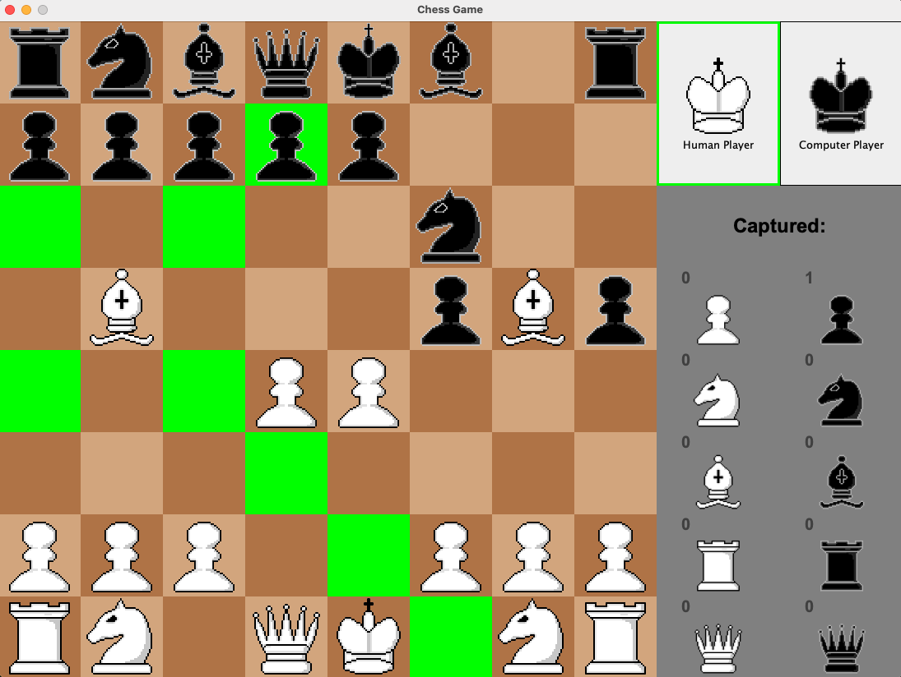

# Java Chess Game - Human vs AI
Written in pure Java, this purpose of this project was to deepen my understanding of core coding concepts such as OOP and SOLID principles and explore more advanced topics I'm interested in, such as game theory and AI. Keep reading to learn more about those implementation, details or run the game to enjoy a classic game of chess!



## Table of Contents
- [Prerequisites](#prerequisites)
- [Installation](#installation)
- [The GUI](#the-gui)
- [The AI Engine](#the-ai-engine)
- [Further Improvements](#further-improvements)

## Prerequisites
The following prerequisites are necessary for installation:

- Java Development Kit (JDK) 8 or higher
- Git (optional, for cloning the repository)

## Installation

1. Open a terminal and run:

   ```bash
   git clone https://github.com/eimaneltigani/JavaChessGame.git
   ```
2. Navigate to the project directory
    ```bash
    cd JavaChessGame
    ```
3. Compile the Java source files:

   ```bash
   javac src/**/*.java
   ```
4. Run the game:
    ```bash
   java -cp out Main
   ```

## The GUI
Built using Java Swing with simple and easy-to-use features:
* Available moves are highlighted after user-click
* Click functionality only enabled for legal moves, ensuring game accuracy
* Side panel highlights current players turn and displays captured pieces for both teams
* Supports advanced moves such as castling, pawn promotions, etc.
* Warning when King is in check

## The AI Engine
The Computer uses a decision-making algorithm used in two-player games called Minimax.
This recursive algorithm evaluates all possible moves of a player and returns the best move based off the potential outcome of the board and its corresponding score. 
Based off the assumption the opponent will play their most optimal move (providing the worst score for the player), the search will return the maximum or minimum score based off who's turn it is throughout the game tree.

### Performance
Considering the large branching factor (~35) estimated for chess, a popular optimization technique called Alpha-Beta pruning was implemented to reduce computation time. This technique works by pruning nodes that are guaranteed to lead to a worst outcome compared to our previous positions.
For example, consider the diagram below:


After returning the outcomes for each move at the base of the tree, it is now the Maximizing players turn to pick the best one. For Node D, they will choose the highest score of 5. For Node E, the first branch guarantees a score >= 6. Despite the potential for an even higher outcome with the other branch, we know parent node B will choose lowest value D regardless. As a result, no further search is necessary!

| Depth: 3       | MiniMax   | + Alpha-Beta |
|----------------|-----------|--------------|
| Nodes reached: | 11,513    | 6,322        |
| Time elapsed:  | 995.73 ms | 421.19 ms    |

Though I implemented only one of many optimization techniques, the above comparison shows the significant difference with just one technique!

### Evaluation
A simple evaluation of the board is measured using these considerations:
* Material (sum of piece values of each side)
* Positional (number of moves compared to opponent)
* Bonus for captured kill
* Repeated move penalty

## Bottlenecks and future considerations
Here are major improvements and differences and changes I'd make to focus on performance and scalability:  
* <u>Performance</u>
  * _Limitation:_ Use of classes for data representation requires lengthy iterations and information retrieval times
    * **Improvement:** Using bitboard representation for faster computations and improved memory
  * _Limitation:_ Game runs on a single thread, which limits the speed and interactivity of processing
    * **Improvement:** Multi-threading to compute branches in parallel and/or create multi-player networks for online gameplay
  * _Limitation:_ Evaluations are recalculated for each end node, accounting for a significant portion of the search run time
    * **Improvement:** Using a hashtable to store previous boards and their scores to reduce search space and speed
* <u>Evaluation</u>
  * _Limitation:_ My simplified evaluation highlights metrics not typically found early on in the game like kills, leading the computer to choose random moves and a weak opening strategy
    * **Improvement:** Defining different rules and advantages based on the current game phase (i.e., opening, middle, end) improves strategy and better replicates how humans play.


### Helpful Resources
_________
1. For getting started, this [Chess Programming Wiki](https://www.chessprogramming.org/Main_Page) was a great resource on the basics of building a chess engine. 
2. For specific questions or comments regarding this project, feel free to reach out to me:
   eltiganieiman@gmail.com